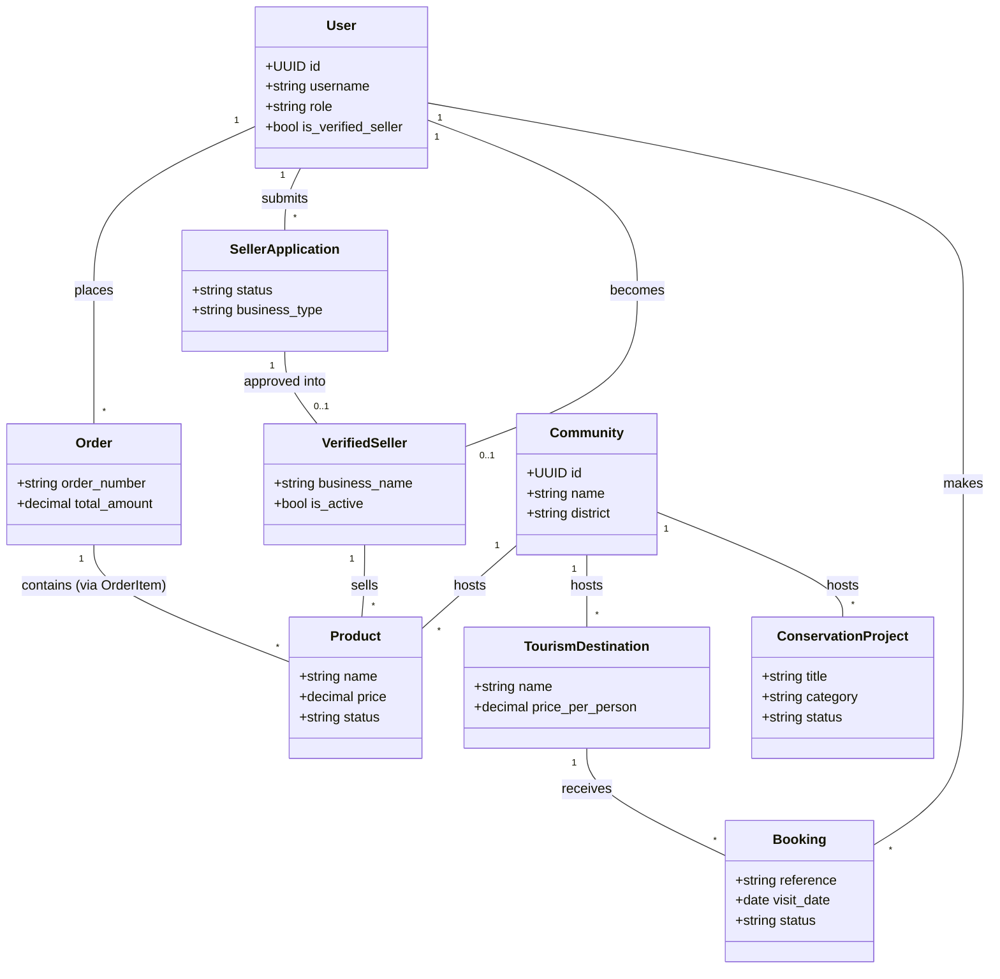
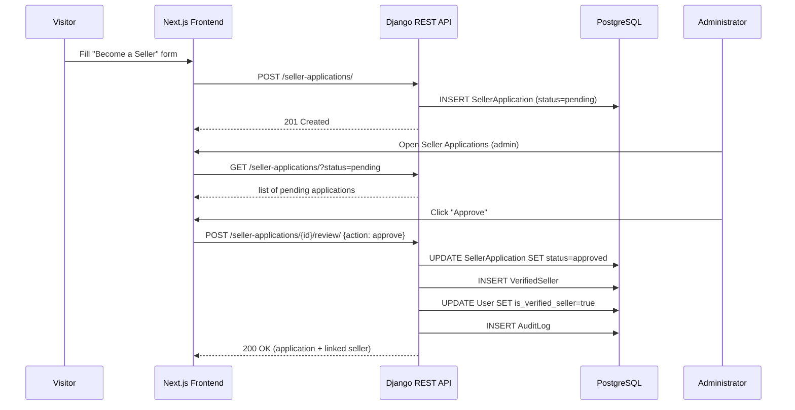
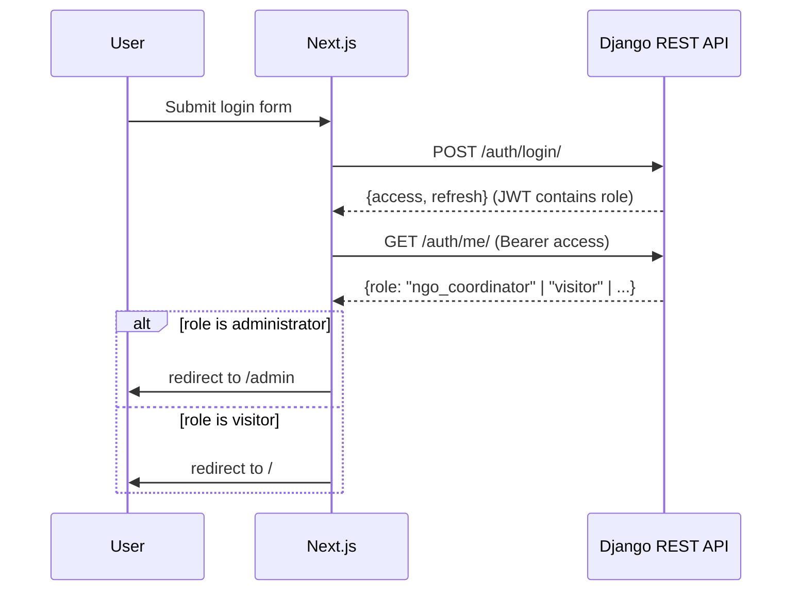
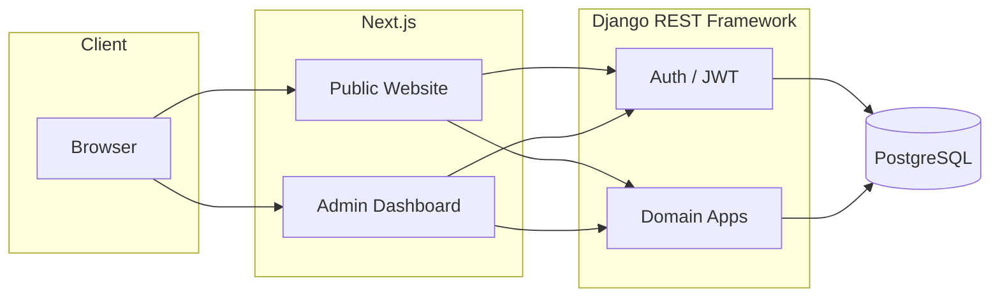

# UML & Architecture Diagrams

Rendered with Mermaid — view on GitHub, in VS Code (Mermaid extension), or
at https://mermaid.live by pasting a block.

## 1. Class diagram — core domain

## 2. Sequence — seller application → verified seller

## 3. Sequence — authentication & role-based redirect

## 4. High-level architecture

